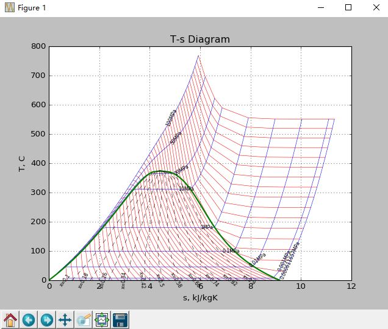

# SEUIF97

**Purpose:** Provide a high-speed shared library for developers to calculate the properties of water and steam  in extensive process simulations, such as Computational Fluid Dynamics (CFD), heat cycle calculations, simulations of non-stationary processes, and real-time process optimizations, where the direct IAPWS-IF97 implementation may be unsuitable because of their computing time consumption.
 
 Through the high-speed library, the results of the IAPWS-IF97  are accurately produced at above 3 times computational speed.
 
        Algorithm of the High-speed IAPWS-IF97 Library: 

        王培红,贾俊颖,程懋华. 水和水蒸汽热力性质IAPWS-IF97公式的通用计算模型[J]. 动力工程. 2001 21(6)：1564-1567(EI)
 
 This library is written in ANSI C for faster, smaller binaries and better compatibility for accessing the DLL/SO from different C++ compilers.
 
 For Windows and Linux users, convenient binary packages are provided.
 
         IF97 shared library: Windows(64):libseuif97.dll, Linux(64):libseuif97.so
 
 The package includes bindings for Python, Microsoft Excel. 
        
        Python API：seuif97.py
        
        Microsoft Excel Macro: DEMO_SEUIF97.xlsm,SEUIF97.xlam
 
**Author:** Cheng Maohua, Southeast University, Nanjing，China  (cmh@seu.edu.cn)

# Python 

* Python API: **seuif97.py** 

## Windows64 
  
1. copy **libseuif97.dll**  to a default path of Windows dll
      
        C:\Windows\system
   
2. copy **seuif97.py** to a default path of Python lib
    
        C:\Python35\Lib 
   
##  Linux64   
    
 1. copy **libseuif97.so**  to a default path of Linux shared lib
   
        $ sudo cp libseuif97.so /usr/lib/

 2. copy **seuif97.py** to a default path of Python lib
   
        $ sudo cp seuif97.py /usr/lib/python3.5/
        
# demo

## Quick start

```python
import seuif97

p=16.10
t=535.10

h=seuif97.pt2h(p,t)
```
## T-s Diagram:

 * **Diagram_T-S.py**

  

# ExcelVBA

* Excel Add-in Macro:SEUIF97.xlam

* Excel VBA:  DEMO_SEUIF97.xlsm

* Guide: /doc/SEUIF97_Add-in.doc(Chinese)

# SEUIF97 shared library

## Functions 

```c
   seupt( pressure,    temperature, propertyID)
   seuph( pressure,    enthalpy,    propertyID)
   seups( pressure,    entropy,     propertyID)
   seuhs( enthalpy,    entropy,     propertyID)
   seupx( pressure,    quality,     propertyID)
   seutx( temperature, quality,     propertyID)
```

   *  propertyID  - int，0-29,(see **Properties in libseuif97**)

### [C Example for Windows](./example-c-win)  
    
      Windows64 DLL：libseuif97.dll：
      GCC: MinGW-w64

* demo.c      

```c
#include <stdio.h>
#include <stdlib.h>

#include "seuif97.h"

int main(void) {

    double p=16.13;
    double t=535;
    double h;

    h=seupt(p,t,4);
    printf("(p,t) (%f,%f) h= %f",p,t,h);
    return EXIT_SUCCESS;
}
```

* makefile

```bash

all: demo.exe

clean:
	del demo.exe *.o

demo.exe: demo.o libseuif97.dll
	gcc -o demo demo.o  -L./ -lseuif97
	del *.o

demo.o: demo.c seuif97.h
	gcc -c demo.c 

```

## Function for process  
   
*  1 Isentropic Enthalpy Drop： ishd( pi,ti,pe)
    
        pi - double,inlet P; ti - double,inlet T

        pe - double,outlet P

* 2 Isentropic Efficiency： ief( pi,ti,pe,te)

         pi  -double，inlet P; ti  - double,inlet T

         pe  -double，outlet P; te  - double, outlet T

## Properties in libseuif97

|   Properties |    Unit     |  symbol  |  propertyID   |   
| ----------------|:----------:| ------:|-------:|
| Pressure        |   MPa     |  P     |   0     |  
| Temperature     |   °C      |  t     |   1     |
| Density         | kg/m^3    |  d     |   2     |
| Specific Volume | m^3/kg    |  v     |   3     |
| Specific enthalpy  | kJ/kg     |  h     |   4     |
| Specific entropy   | kJ/(kg·K) |  s     |   5     |
| Specific  exergy   | kJ/kg     |  e     |   6     |
| Specific internal energy   | kJ/kg     |  u     |   7     |
| Specific isobaric heat capacity  | kJ/(kg·K) |  cp    |   8     |
| Specific isochoric heat capacity  | kJ/(kg·K) |  cv    |   9     |		
| Speed of sound          | m/s       |   w     | 10      |	
| Isentropic exponent     |             |  ks     | 11      |	
| Specific Helmholtz free energy   |   kJ/kg          |  f     | 12      |	
| Specific Gibbs free energy       |   kJ/kg           | g     | 13      |	
| Compressibility factor           |                      | z      | 14      |
| Steam quality                    |                      | x      | 15      |
| Region                           |                      | r       | 16      |
| Isobaric volume expansion coefficient  |        1/K       | ec     | 17      |
| Isothermal compressibility             |        1/MPa   | kt     | 18      |
| Partial derivative (dV/dT)p            |    m3/(kg·K)	     | dvdt     | 19      |
| Partial derivative (dV/dP)T            |    m3/(kg·MPa)	  | dvdp    | 20      |
| Partial derivative (dP/dT)v            |    MPa/K	         | dpdt	    | 21      |
| Isothermal Joule-Thomson coefficient   |   kJ/(kg·MPa)        | iJTC	    | 22      |
| Joule-Thomson coefficient              |  K/MPa        | JTC	    | 23      |
| Dynamic viscosity                      |        kg/(m·s)   | dv     | 24      |
| Kinematic viscosity                    |       m^2/s       | kv     | 25      |
| Thermal conductivity                   |       W/(m.K)	  | tc     | 26      |
| Thermal diffusivity                    |       um^2/s	 | td     | 27      |
| Prandtl number                         |            	  | pr     | 28      |
| Surface tension                        |       mN/m    	  | st     | 29      |
