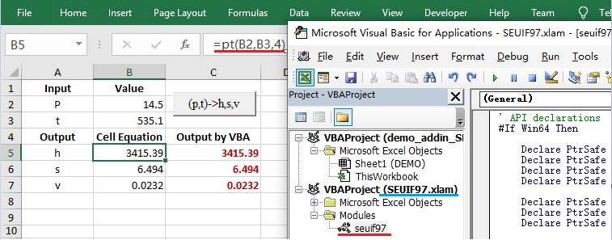

# SEUIF97

 The high-speed shared library is provided for developers to calculate the properties of water and steam where the direct IAPWS-IF97 implementation may be unsuitable because of their computing time consumption, such as Computational Fluid Dynamics (CFD), heat cycle calculations, simulations of non-stationary processes, and real-time process optimizations. 
 
Through the high-speed library, the results of the IAPWS-IF97 are accurately produced at about 3 times computational speed than the repeated squaring method for fast computation of large positive integer powers.
 
The library is written in ANSI C for faster, smaller binaries and better compatibility for accessing the DLL/SO from different programming languages.
 
For Windows and Linux users, the convenient binary library and APIs are provided.
 
* The shared library: Windows32/64: `libseuif97.dll`; Linux64: `libseuif97.so`

* The binding API: Python, C/C++, Microsoft Excel VBA, MATLAB,Java, Fortran, C# 
       
**Publications:**

* 王培红,贾俊颖,程懋华. 水和水蒸汽热力性质IAPWS-IF97公式的通用计算模型[J]. 动力工程,2001,21(6)：1564-1567 [[ pdf ]](./doc/水和水蒸汽热力性质IAPWS-IF97公式的通用计算模型.pdf)

* 芮嘉敏,孙振业,程懋华. 基于最短加法链状态空间树的IAPWS-IF97快速计算方法[J]. 汽轮机技术,2017,59(4):245-247 [[ pdf ]](./doc/基于最短加法链状态空间树的IAPWS-IF97快速计算方法.pdf)
 
**Author:** Cheng Maohua, Southeast University, Nanjing，China  (cmh@seu.edu.cn)

## Functions of the SEUIF97 Shared Library

Functions of water and steam properties, exergy analysis and the thermodynamic process of steam turbine are provided in **SEUIF97**

### Functions of Water and Steam Properties

Using SEUIF97, you can set the state of steam using various pairs of know properties to get any output properties you wish to know, including in the [30 properties in libseuif97](#properties-in-libseuif97).

The following input pairs are implemented: 

```c
(p,t) (p,h) (p,s) (p,v) (p,x) 

(t,h) (t,s) (t,v) (t,x) 

(h,s)  
```

### Functions of Thermodynamic Process of Steam Turbine
   
*  1 Isentropic Enthalpy Drop：ishd(pi,ti,pe)

       pi - double,  inlet pressure(MPa); ti - double, inlet temperature(°C)
       pe - double, outlet pressure(MPa)

* 2 Isentropic Efficiency(0~100)： ief(pi,ti,pe,te)

       pi - double,  inlet pressure(MPa); ti - double,  inlet temperature(°C)
       pe - double, outlet pressure(MPa); te - double, outlet temperature(°C)

### [API](./api)

* Python API: [seuif97.py](./api/seuif97.py) 

* C API: [seuif97.h](./api/seuif97.h)  

* Java API: [seuif97.java](./api/seuif97.java)  

* Fortran API: [seuif97.f08](./api/seuif97.f08)  

* C# API: [seuif97.cs](./api/seuif97.cs) 

* Microsoft Excel VBA API:  [seuif97.bas](./api/seuif97.bas)

* MATLAB API:  [seuif97.m](./api/seuif97.m)

## Installing SEUIF97 Library

You may download the repository,then install the library and APIs manually 
for different programming languages.

### [Python Package](./demo-python)

#### 1 pip  install from [PyPI](https://pypi.org/project/seuif97/) 

##### Windows64

 ```bash
 >python -m pip install seuif97
 ```

##### Linux64

 ```bash
 $sudo -H python3 -m pip install seuif97
 ```

#### 2 Install Manually

Download **SEUIF97.zip** of the repository


 Then unzip and install the shared library and APIs manually

 ##### Windows32/64 
  
1. copy **libseuif97.dll**  to a default path of Windows dll
      
       C:\Windows\system
   
2. copy **seuif97.py** to a default path of Python lib. If you have installed Python3.7 in the C:\Python37\, copy to
    
       C:\Python37\Lib 

##### Linux64 
    
 1. copy **libseuif97.so**  to a default path of Linux shared lib
   
        $sudo cp libseuif97.so /usr/lib/

 2. copy **seuif97.py** to a default path of Python lib, if you have installed Python3.6(Ubuntu 18.04) 
   
        $sudo cp seuif97.py /usr/lib/python3.6/

The two type functions are provided in the seuif97 pacakge: 
    
 * ??2?(in1,in2) , e.g: ```h=pt2h(p,t)```
   * first,second input parameters: the input properties(double)
   * the return: the calculated property value(double)
 * ??(in1,in2,propertyID),  , e.g: ```h=pt(p,t,4)```,  the propertyID h is 4
   * first,second input parameters: the input properties(double)
   * third input parameter: the propertyID of the calculated property(int, 0-29), see [Properties in libseuif97](#properties-in-libseuif97)
   * the return: the calculated property value(double)

```python
import seuif97

p，t=16.10,535.10

# ??2?(in1,in2)
h=seuif97.pt2h(p,t)
s=seuif97.pt2s(p,t)
v=seuif97.pt2v(p,t)
print("(p,t),h,s,v:",
      "{:>.2f}\t {:>.2f}\t {:>.2f}\t {:>.3f}\t {:>.4f}".format(p, t, h, s, v))

# ??(in1,in2,propertyid)
t = seuif97.ph(p, h, 1)
s = seuif97.ph(p, h, 5)
v = seuif97.ph(p, h, 3)
print("(p,h),t,s,v:",
      "{:>.2f}\t {:>.2f}\t {:>.2f}\t {:>.3f}\t {:>.4f}".format(p, h, t, s, v))
```

#### [Demo T-s Diagram: Diagram_T-S.py ](./demo-python/Diagram_T-S.py)


### [C/C++ Using GCC](./demo-gcc)  

In C/C++, using syntax like `h =  seupt(p, t, 4)`

```c
#include <stdio.h>
#include <stdlib.h>
#include "seuif97.h"

int main(void)
{

    double p = 16.13;
    double t = 535;
    double h, s, v;

    h = seupt(p, t, 4);
    s = seupt(p, t, 5);
    v = seupt(p, t, 3);
    printf("(p,t)(%.2f,%.2f) h= %.2f, s= %.4f, v= %.4f\n", p, t, h, s, v);
    return EXIT_SUCCESS;
}

```
### [MS Excel VBA(32/64)](./ExcelVBA)

* Copy Excel Add-in Macro of libseuif97.dll: [SEUIF97.xlam](./ExcelVBA/SEUIF97.xlam) to the path `\XLStart` to load the add-in automatically when Excel starts up
   
   For Example，Excel 2016: `C:\Program Files\Microsoft Office\root\Office16\XLSTART`

* Demo Excel Workbook with macro enabled: [demo_addin_SEUIF97.xlsm](./ExcelVBA/demo_addin_SEUIF97.xlsm)

In Excel VBA, using syntax like `=if97pt(p, t, 4)`



### [MATLAB for Windows64](./demo-matlab/)

* copy the folder `\seuif97` in `MATLAB64` to the path `\extern` of the installed MATLAB

   For example,if MATLAB 2018a is installed : `C:\Program Files\MATLAB\R2018a\extern\`

* Add the path  `C:\Program Files\MATLAB\R2018a\extern\seuif97` to the Search Path of MATLAB

In MATLAB, using syntax like `=pt(p, t, 4)`

```MATLAB
myfuns = seuif97;
p=18.0;
t=535;
h=myfuns.pt(p,t,4);
s=myfuns.pt(p,t,5);
v=myfuns.pt(p,t,3);
fprintf('(p,t),h,s,v: %.2f,%.2f,%.2f,%.4f,%.4f\n',p,t,h,s,v);
```

### [Java](./demo-java)

Using [JNA](https://github.com/java-native-access/jna) to access libseuif97 library.

In Java, using syntax like `h=seuif97.INSTANCE.seupt(p, t, 4)`

```java
public class demoseuif97 {

    public static void main(String[] args){
        double p=16.0;
        double t=540.0;
        double h;
        h=seuif97.INSTANCE.seupt(p,t,4);
        System.out.printf("(p,t)->h: (%.1f %.1f) h: %.2f ",p,t,h);
   }
} 
```

### [Fortran Using gfortran](./demo-Fortran)

In Fortran, using syntax like `h=seupt(p, t, 4)`

```fortran
program demo
  use iso_c_binding
  use seuif97
  implicit none
  real(c_double) :: p,t,h,s,v
  p = 16.13;
  t = 535.0;
  h = seupt(p, t, 4);
  s = seupt(p, t, 5);
  v = seupt(p, t, 3);
  write (*,'(A,F10.2,F10.2,F10.2,F10.4,F10.4)') "(p,t),h,s,v",p,t,h,s,v 
end program demo
```

### [C Sharp](./demo-csharp)

In C#, using syntax like `h = Seuif97.seupt(p, t, 4)`

```csharp
using System;
using seuif97;

namespace demo_seuif97
{
    class demo_seuif97
    {
        static void Main(string[] args)
        {
            double p = 16.13;
            double t = 535.0;
            double h, s, v;
            h = Seuif97.seupt(p, t, 4);
            s = Seuif97.seupt(p, t, 5);
            v = Seuif97.seupt(p, t, 3);
            Console.WriteLine("(p,t) h,s,v {0 :.00} {1:.0} {2:.000} {3:.000} {4:.000}", p, t, h, s, v);
       }
    }
}
```

## The Function Prototypes in C

If you need to modify the APIs provided in the repository or program your own APIs, you can refer to the library's header file: [seuif97.h](./api/seuif97.h). 

```cpp
// Functions of Properties
double seupt(double pressure,    double temperature, int propertyID);
double seuph(double pressure,    double enthalpy,    int propertyID);
double seups(double pressure,    double entropy,     int propertyID);
double seupv(double pressure,    double volume,      int propertyID);

double seuth(double temperature, double enthalpy, int propertyID);
double seuts(double temperature, double entropy,  int propertyID);
double seutv(double temperature, double volume,   int propertyID);

double seuhs(double enthalpy,    double entropy,  int propertyID);

double seupx(double pressure,    double quality,  int propertyID);
double seutx(double temperature, double quality,  int propertyID);

//  The Functions of Exergy 
//    tu: temperature(°C), exergy reference environment
double seupt2eu(double p, double t, double tu);
double seups2eu(double p, double s, double tu);
double seuph2eu(double p, double h, double tu);
double seupv2eu(double p, double v, double tu);

double seuth2eu(double t, double h, double tu);
double seuts2eu(double t, double s, double tu);
double seutv2eu(double t, double v, double tu);

double seuhs2eu(double h, double s, double tu);

double seupx2eu(double p, double x, double tu);
double seutx2eu(double t, double x, double tu);

//The Functions for Thermodynamic Process of Steam Turbine
double seuishd(double pi, double ti, double pe);
double seuief(double pi, double ti, double pe, double te);

```

## Properties in libseuif97

|   Properties |    Unit     |  symbol  |  propertyID   |   
| ----------------|:----------:| ------:|-------:|
| Pressure        |   MPa     |  p     |   0     |  
| Temperature     |   °C      |  t     |   1     |
| Density         | kg/m^3    |  d     |   2     |
| Specific Volume | m^3/kg    |  v     |   3     |
| Specific enthalpy  | kJ/kg     |  h     |   4     |
| Specific entropy   | kJ/(kg·K) |  s     |   5     |
| Specific exergy   | kJ/kg     |  e     |   6     |
| Specific internal energy   | kJ/kg     |  u     |   7     |
| Specific isobaric heat capacity  | kJ/(kg·K) |  cp    |   8     |
| Specific isochoric heat capacity  | kJ/(kg·K) |  cv    |   9     |		
| Speed of sound          | m/s       |   w     | 10      |	
| Isentropic exponent     |             |  ks     | 11      |	
| Specific Helmholtz free energy   |   kJ/kg          |  f     | 12      |	
| Specific Gibbs free energy       |   kJ/kg           | g     | 13      |	
| Compressibility factor           |                      | z      | 14      |
| Steam quality                    |                      | x      | 15      |
| Region                           |                      | r       | 16      |
| Isobaric volume expansion coefficient  |        1/K       | ec     | 17      |
| Isothermal compressibility             |        1/MPa   | kt     | 18      |
| Partial derivative (dV/dT)p            |    m3/(kg·K)	     | dvdt     | 19      |
| Partial derivative (dV/dP)T            |    m3/(kg·MPa)	  | dvdp    | 20      |
| Partial derivative (dP/dT)v            |    MPa/K	         | dpdt	    | 21      |
| Isothermal Joule-Thomson coefficient   |   kJ/(kg·MPa)        | iJTC	    | 22      |
| Joule-Thomson coefficient              |  K/MPa        | JTC	    | 23      |
| Dynamic viscosity                      |        kg/(m·s)   | dv     | 24      |
| Kinematic viscosity                    |       m^2/s       | kv     | 25      |
| Thermal conductivity                   |       W/(m.K)	  | tc     | 26      |
| Thermal diffusivity                    |       um^2/s	 | td     | 27      |
| Prandtl number                         |            	  | pr     | 28      |
| Surface tension                        |       mN/m    	  | st     | 29      |
