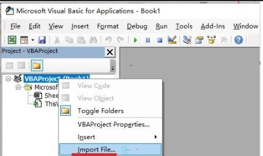

# Excel VBA with seuif97 module to libseuif97.dll  

## 1 Copy `libseuif97.dll` to the default path of Windows's dll(32/64)

copy `libseuif97.dll` in the [Windows/x86](../../shared_lib/Windows/x86) or [Windows/x64](../../shared_lib/Windows/x64) folder to a default path of Windows32/64's DLL :   `C:\Windows\system`

## 2 Excel workbook(macro enabled) with seuif97 module to libseuif97.dll

From the `Developer Tools` tab, you can click the `Visual Basic` button ,then `Import File` [seuif97.bas](./seuif97.bas) into the workbook that uses it.

## 3 The template xlsm file of using `seuif97.bas` module: 

you may use  [app_template_seuif97.xlsm](./app_template_seuif97.xlsm) to start your work .
