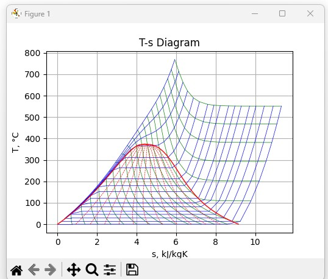

# Python

## Install SEUIF97 library manually

Put the shared library in the default `Lib` path of OS or the programming language,

then,copy **seuif97.py** in the [api](./api) folder to a default path of Python's lib.

**Windows(x86/64)** 

If you have installed Python3.8 in the C:\Python38\, copy to
    
       C:\Python38\Lib 

**Linux(x64/aarch64)**

If you have installed Python3.8 

```bash  
$sudo cp seuif97.py /usr/lib/python3.8/
```

## Functions

The two type functions are provided in the  [seuif97.py](../../api/seuif97.py):

* ??2?(in1,in2) , e.g: `h=pt2h(p,t)`
  
  * first,second input parameters: the input properties(double)
  * the return: the calculated property value(double)

* ??(in1,in2,propertyID), , e.g:`h=pt(p,t,4)`, the propertyID h is 4 
   * first,second input parameters: the input properties(double)
   * third input parameter: the propertyID of the calculated property(int, 0-29), see Properties in libseuif97
   * the return: the calculated property value(double)

```python
import seuif97

p，t=16.10,535.10

# ??2?(in1,in2)
h=seuif97.pt2h(p,t)
s=seuif97.pt2s(p,t)
v=seuif97.pt2v(p,t)
print("(p,t),h,s,v:",
      "{:>.2f}\t {:>.2f}\t {:>.2f}\t {:>.3f}\t {:>.4f}".format(p, t, h, s, v))

# ??(in1,in2,propertyid)
t = seuif97.ph(p, h, 1)
s = seuif97.ph(p, h, 5)
v = seuif97.ph(p, h, 3)
print("(p,h),t,s,v:",
      "{:>.2f}\t {:>.2f}\t {:>.2f}\t {:>.3f}\t {:>.4f}".format(p, h, t, s, v))  
```

#### [Diagram T-S](./Diagram_T-S.py)

